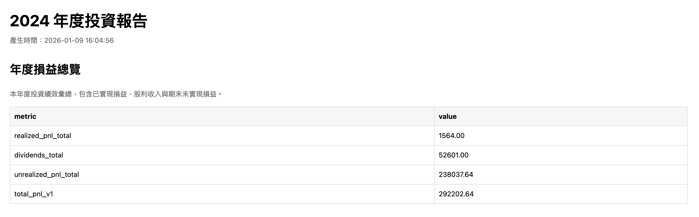
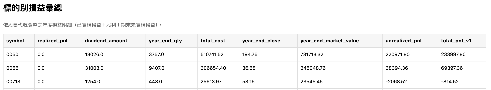
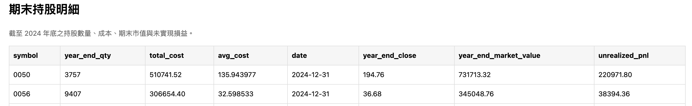
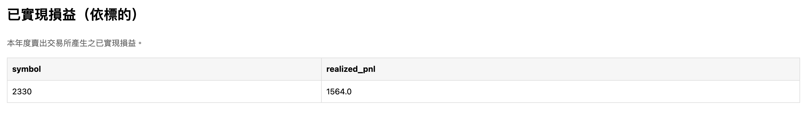
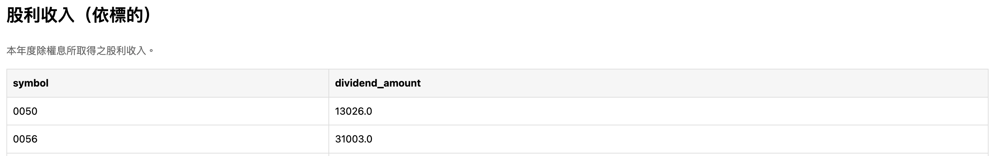

# InvestmentTracker

## Project Overview
This project is a yearly batch-processing tool that processes transactions, inventory, dividends, and prices to generate annual investment results.

## Workflow
1. Initialize: Set the start year and initialize the opening inventory; otherwise, load the ending inventory from the previous year.
2. Process trasactions (FIFO): Process trasactions in chronological order; buy trasactions create inventory lots, and sell transactions consume inventory based on FIFO and generate realized gains/losses.
3. Snapshot for dividends: Generate inventory snapshots for each stock based on dividend-related dates.
4. Caculate dividends: Calculate dividends amounts using the corresponding inventory snapshots.
5. yearly results: Aggregate PnL and inventory data, and generate yearly investment results and reports(CSV,HTML).

## Data Preparation
This project is a batch, offline processing toool.
All caculations require data to be prepared before execution.

1. `trasaction_record.csv`: Records all buy and sell transactions.
Transactions are processed in chronological order and serve as the primary input for FIFO calculations.

    | transaction_date | stock_symbol | stock_name | side | flag | price  | qty | total_price |
    |------------------|--------------|------------|------|------|--------|-----|-------------|
    | 2023/01/16       | 0050         | 元大台灣50 | BUY  | -1   | 118.25 | 84  | -9933       |

2. `inventory.csv`: Defines the opening inventory only for the starting year.
    | transaction_date | stock_symbol | stock_name | qty |
    |------------------|--------------|------------|-----|


3. `actions.csv`: Records corporate actions that affect inventory structure, such as stock splits.
    | action_date | symbol | action_type | ratio_from | ratio_to |
    |-------------|--------|-------------|------------|----------|
    | 2025/06/10  | 0050   | SPLIT       | 1          | 4        |

4. `dividends_history.csv`: Stores historical dividend information for each stock.
    | symbol | ex_dividend_date | dividends |
    |--------|------------------|-----------|
    | 0050   | 2026/01/22       | 1         |


5. `close_price.csv`: Provides historical closing prices for each stock. Closing prices are used to calculate unrealized PnL at year end.
    | symbol | date       | close_price |
    |--------|------------|-------------|
    | 0050   | 2021/12/30 | 145.5       |


## How to use 
This is a CLI-based tool that processes one year per run.

- env 
    ```
    python3 -m venv .venv
    source .venv/bin/activate
    ```

- packages

    ```
    pip install pandas
    pip install openpyxl
    ```

- CLI arguments

    ```
    python3 run_year.py <year> [--is-start]
    ```
    - `year`: The year to be processed (e.g., 2021, 2022, etc.).
    - `--is-start`: Optional flag indicating whether it is the initial year of processing. If set, the program will initialize the opening inventory from `inventory.csv`. If not set, it will load the ending inventory from the previous year's results.

- Example usage
    ```
    python3 run_year.py 2021 --is-start
    python3 run_year.py 2022
    ```

## Outputs






## Further Work 

- Automate data collection: Replace manual CSV inputs with automated pipelines (crawler or APIs) to fetch public market data, such as dividends and closing prices.
- Enhance reporting and metrics: Improve the annual reports by adding more performance indicators.

