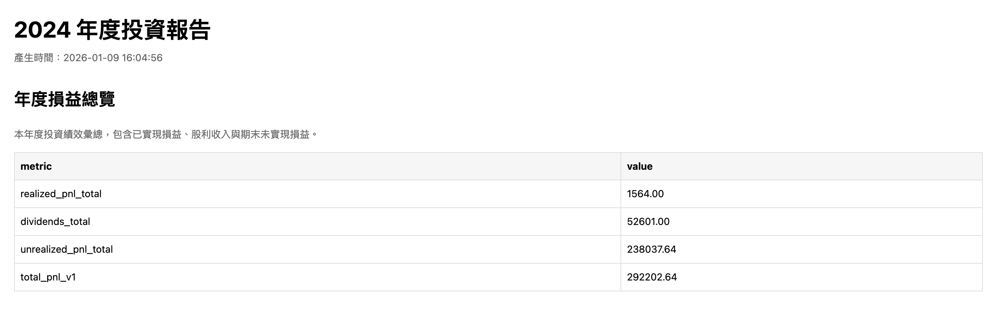
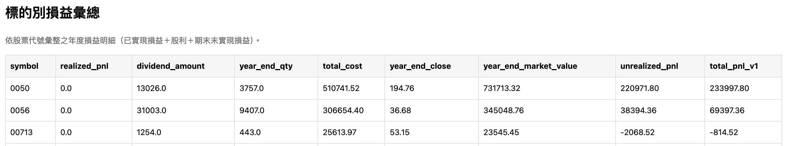
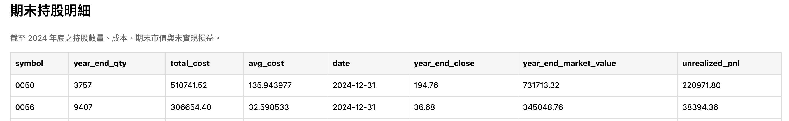
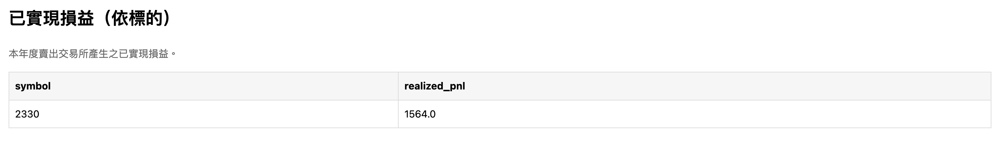
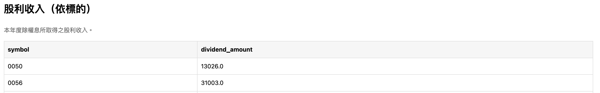

### 專案概述
這個專案是一個以年度為單位執行的批次處理工具，用來整理交易紀錄、持股庫存、股利與收盤價資料，並產出年度投資損益結果。

### 處理流程
1. 初始化：設定起始年份，並建立期初庫存；若不是起始年，則讀取前一年度的期末庫存。
2. 處理交易（FIFO）：依交易時間順序處理買賣資料；買進會建立新的庫存批次，賣出則依 FIFO 順序扣減庫存並計算已實現損益。
3. 建立股利快照：依各股票的股利相關日期，建立對應時點的庫存快照。
4. 計算股利：根據快照庫存數量計算股利金額。
5. 產出年度結果：彙整損益與庫存資料，輸出年度投資結果與報表（CSV、HTML）。

### 資料準備
此專案屬於離線批次處理工具，所有計算都依賴事先準備好的資料檔案。

1. `trasaction_record.csv`
   記錄所有買進與賣出交易。系統會依時間順序處理，作為 FIFO 計算的主要輸入資料。

2. `inventory.csv`
   只在起始年度使用，用來定義期初持股庫存。

3. `actions.csv`
   記錄會影響庫存結構的公司行為，例如股票分割。

4. `dividends_history.csv`
   儲存各股票的歷史股利資訊。

5. `close_price.csv`
   提供各股票的歷史收盤價，主要用來計算年末未實現損益。

### 使用方式
這是一個 CLI 工具，每次執行只處理一個年度。

- 建立虛擬環境

  ```bash
  python3 -m venv .venv
  source .venv/bin/activate
  ```

- 安裝套件

  ```bash
  pip install pandas
  pip install openpyxl
  ```

- CLI 參數

  ```bash
  python3 run_year.py <year> [--is-start]
  ```

  - `year`：要處理的年度，例如 `2021`、`2022`。
  - `--is-start`：可選參數，表示該年度是否為起始年度。若有設定，程式會從 `inventory.csv` 初始化期初庫存；若未設定，則會讀取前一年輸出的期末庫存。

- 執行範例

  ```bash
  python3 run_year.py 2021 --is-start
  python3 run_year.py 2022
  ```

### 輸出結果
程式會輸出年度投資結果報表，範例畫面如下：







### 後續可擴充方向

- 自動化資料蒐集：以爬蟲或 API 取代手動整理 CSV，取得公開市場資料，例如股利與收盤價。
- 強化報表與指標：在年度報表中加入更多績效分析指標。
